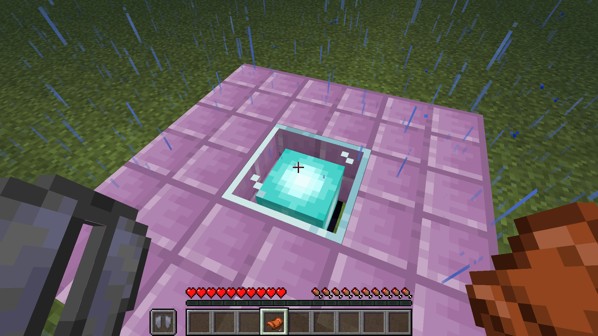
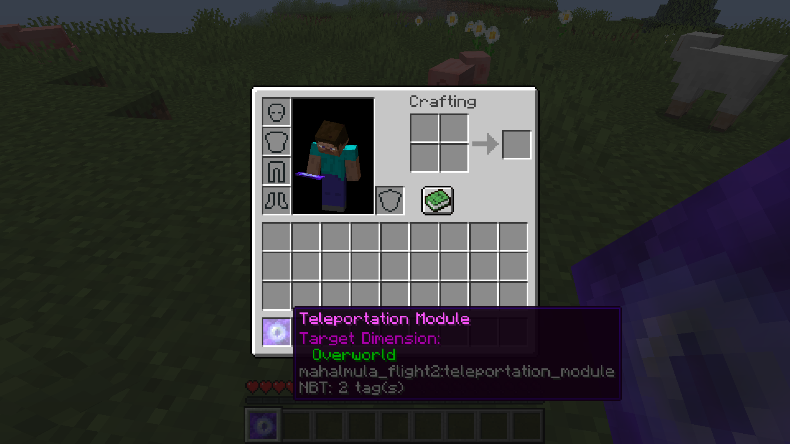
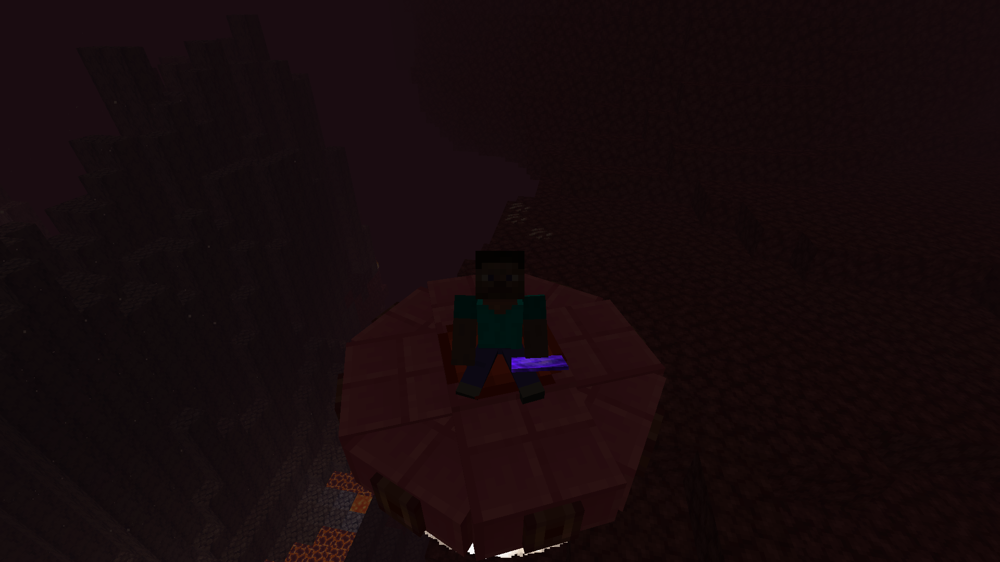
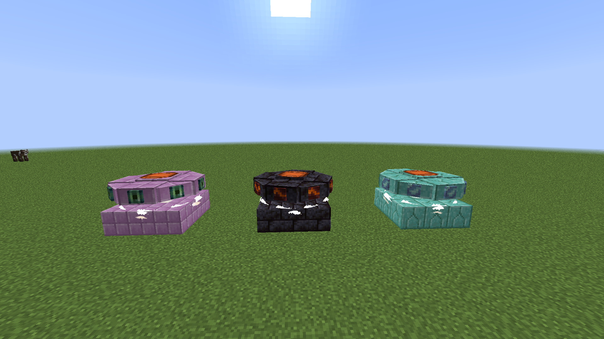
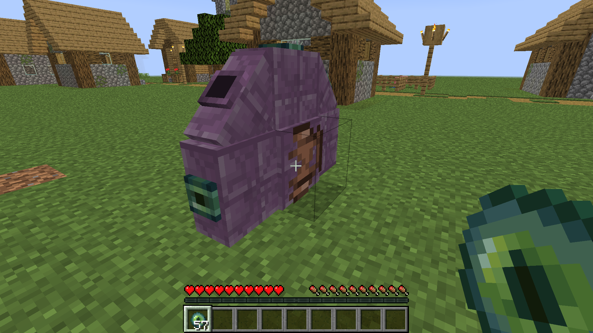

# Some questions about Mahalmula Flight

>What is "Mahalmula"?

So. Mahalmula is an alian race. Don't worry about it.

>What does the mod add?

So. The mod adds:
* Mahalmula's flight ship
* ...That's all...

>What can I do with the ship?

So. You can:
* Fly on it
* Travel between dimensions
* Open the ender-chest inventory
* Customize it

>How do I obtain the ship?

So. You need to `right-click` to **the beacon** with **the saddle** in `main-hand` and **the elytra** in `off-hand` in this structure: 

>How can I travel between dimensions using my ship?

So. You need a specific item: **the Teleportation Module**. You should *store* dimension into this by `right-clicking` to the block while you're in this dimension
 
Then you should take **the Teleporation Module** in `off-hand`. Tap the `teleportation button`(you can setup it in settings) while you are piloting the ship and *bada-boom*: you are in the other dimension! 
 

>How do I customize my ship?

So. You need to `right-click` with **the colorful shell** in `main-hand` while you are piloting the ship. The skin will be changed

>What is `flight events`?

So. If you see messages like `Warning: Inner Portals Are Overcooled!`, `Warning: Leak Of Fuel!` or `Warning: Navigation Schemes Are Damaged!` you faced the `flight event`. You should `right-click` with the associated item in `main-hand`. If you don't, your ship will crash.

Don't worry! You can repair it with ender eyes!

|        Event         |        Item      |
| -------------------- | ---------------- |
| Portals Overcooling  | Flint And Steel  |
|      Fuel Leak       | Dragon's Breath  |
|  Navigation Schemes  |     Compass      |

